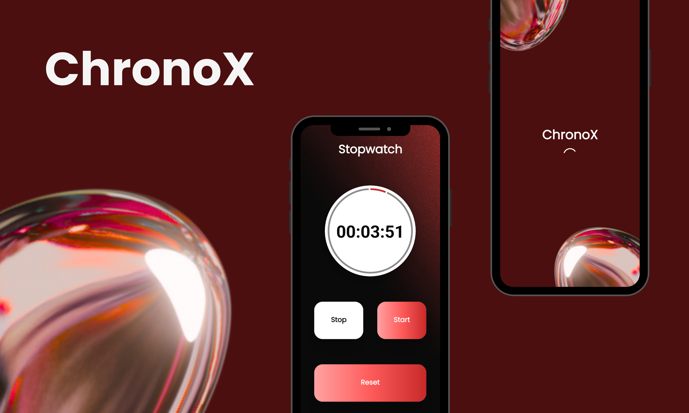

# 🕒 ChronoX Stopwatch App

 

ChronoX is a clean and functional stopwatch app built using **Kotlin**, **ViewBinding**, and custom **XML layouts**. Designed for simplicity and performance, it allows users to start, stop, and reset time while displaying progress in a circular indicator.

## 

---

## 📱 Features

- ⏱ Real-time stopwatch with HH:MM:SS format
- 🔁 Start, Stop, and Reset buttons with dynamic styling
- 🎨 Custom-styled buttons using drawable XML backgrounds
- 🌀 Circular progress bar tracking time visually
- 💡 Built with ViewBinding for type-safe UI access
- 🎯 Optimized for all Android devices (min SDK 21+)

---

## ⚙️ Tech Stack

| Component   | Tool/Tech Used                        |
| ----------- | ------------------------------------- |
| Language    | Kotlin                                |
| UI Design   | XML (ConstraintLayout)                |
| View Access | ViewBinding                           |
| Widgets     | CardView, ProgressIndicator, TextView |
| IDE         | Android Studio                        |

---

## 🚀 Getting Started

1. **Clone this repo**

   ```bash
   git clone https://github.com/Aaditya-Kumar-Mittal/ChronoX-Stopwatch-App.git
   cd ChronoX-Stopwatch-App
   ```

2. **Open with Android Studio**

3. **Run on Emulator or Device**

   - Minimum SDK: 21
   - Target SDK: 34

---

## 📃 License

This project is open source and available under the [MIT License](LICENSE).

---

## 🙋‍♂️ Author

Developed by [Aaditya Kumar Mittal](https://github.com/Aaditya-Kumar-Mittal). ⭐️ Star this repository to support the project!
